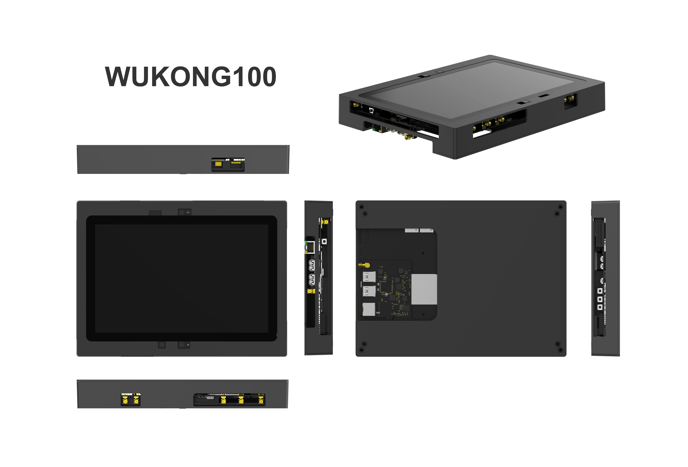
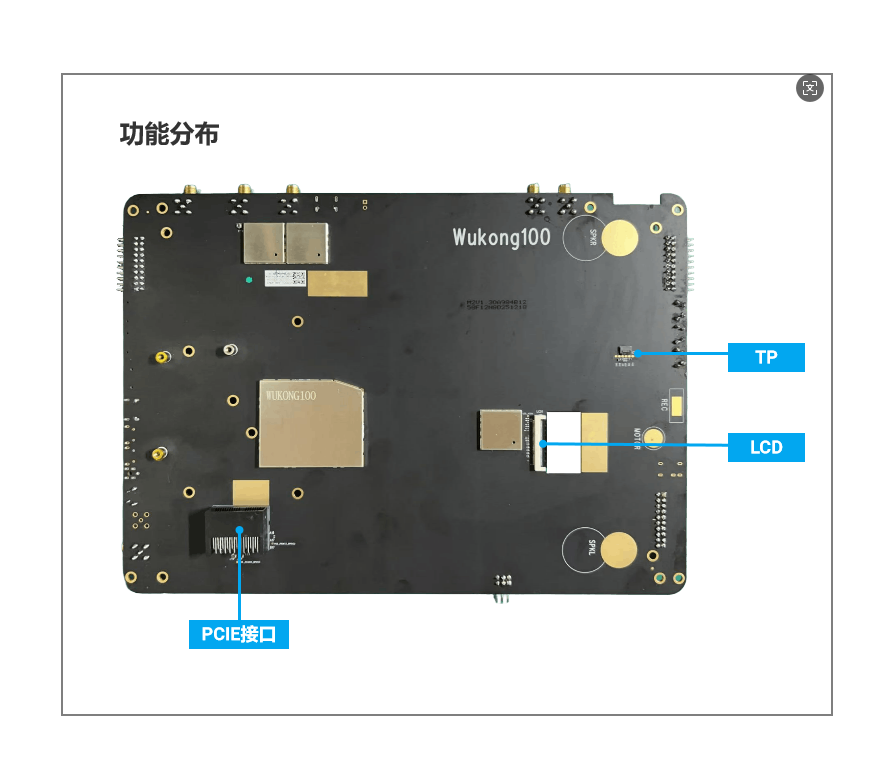
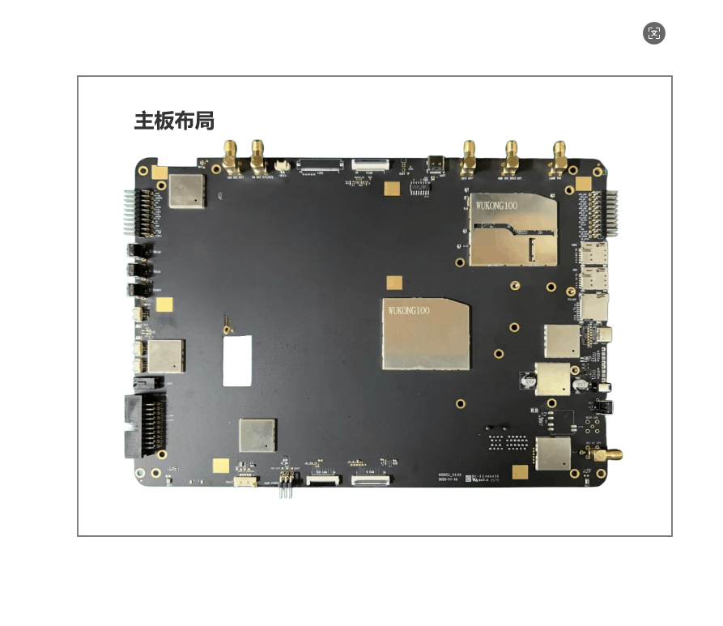
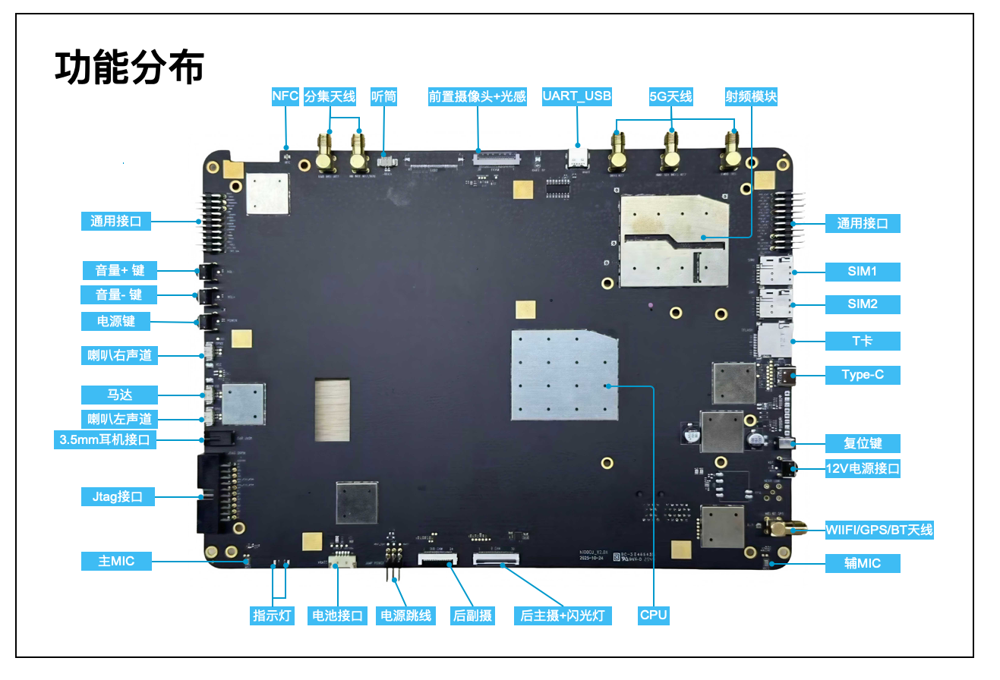

# [Board Name] WUKONG100 Development Kit

# **Introduction**

The WUKONG100 development kit is an embedded hardware platform for high-performance intelligent applications and complex multi-scenario interconnect development within the OpenHarmony open-source project. Based on the UNISOC UIS7885 platform, it features an 8-core processor and NPU, supports multiple sensors, integrates 4G/5G communication, multi-mode positioning, and rich expansion interfaces. It not only smoothly handles high-resolution multimedia tasks and real-time AI computing, but also supports multi-screen display and extensive wireless connectivity, providing a flexible and reliable hardware environment for smart terminals, edge computing, and IoT device development.

Figure 1: WUKONG100 Development Kit Appearance








# **Development Board Details**

Figure 2: WUKONG100 Development Kit Front Interface Diagram




# **Development Board Specifications**

Table 1: WUKONG100 Development Kit Core Specifications


| Specification | Details                          |
| :------- | --------------------------------- |
| SoC      | UIS7885                           |
| CPU      | ARM Cortex-A76x4+ARM Cortex-A55x4 |
| GPU      | Arm Mali-G57                      |
| NPU      | 8.0TOPs                           |
| RAM      | 8GB  LPDDR4X                      |
| ROM      | 256GB UFS                         |


Table 2: WUKONG100 Development Kit Interface Specifications

| Function Module | WUKONG100 Development Kit Interface Specifications |
|------------------------------|----------------------------------------------------------------------------------------------------------------|
| Power                   | DC IN 12V3A |
| Indicator LEDs                  | 2 x PWR LED |
| Debug          | 1x UART_USB debug serial port, 1x JTAG                                        |
| Buttons                   | 1xPower key, 1x Reset key, 1x Vol+/Recovery, 1 x VoL- |
| Display Interface               | 1 x  4-lane MIPI_DSI, supports TYPE-C video output (can be converted to DP or HDMI) |
| Camera Interface                   | 3x MIPI_CSI (4LANE) |
| Display Screen | 10.1 inch, FHD 1920*1200 60Hz |
| Touch Screen | Capacitive touch screen |
| USB                          | 1x TYPE-C USB3.0, 2 x USB3.0 TYPE-A HOST, supports USB camera |
| Sensor                     | 1x accel, 1x gyro, 1x als, 1x proximity, 1x magnetic |
| Motor                       | 1x linear motor                                        |
| LAN                  | 1x RJ45 Gigabit                                  |
| Cellular Data                     | 2G bands: B2/3/5/8, 3G bands: B1/2/5/8, 4G bands: B1/2/3/5/7/8/20/34/38/39/40/41, 5G bands: N1/3/5/8/28/41/77/78 |
| Wireless Network                     | Supports WIFI5 5GHz/2.4GHz, 802.11b/g/n/ac, 1x antenna             |
| Bluetooth                         | BT5.0                                                        |
| NearLink                         | Supports SLE1.0 protocol                                               |
| Audio                         | 1x headphone output (3.5mm, CTIA), left and right channel SPK socket (2Pins 2W@8ohm), 2 x silicon microphone |
| SIM Card                       | 2 x SIM (Nano-SIM) supports hot-swapping                                |
| SD Card Slot                       | 1 x SD card slot, supports SDXC UHS-II                                  |
| Positioning | Supports GPS, GLONASS, Galileo, BeiDou (BDS) |
| PCIe Interface | 36-pin standard PCIe interface |
| Other Expansion Interfaces | 2 xUART serial ports, 20xGPIO, 2xI2C interfaces, 2 x SPI interfaces, 2xADC inputs, 2xPWM outputs, 1xI2S interface |

# **Setting Up Development Environment**

## **Development Environment Preparation**

### Operating System

- Ubuntu 20.04 and above, X86_64 architecture, 16 GB or more memory recommended.

- Ubuntu system username cannot contain Chinese characters.

### **Environment Code Preparation**

#### **Prerequisites**

1) Register a GitCode account.

2) Register SSH public key.

3) Install [git client](http://git-scm.com/book/zh/v2/%E8%B5%B7%E6%AD%A5-%E5%AE%89%E8%A3%85-Git) and [git-lfs](https://gitee.com/vcs-all-in-one/git-lfs?_from=gitee_search#downloading) and configure user information.

```
git config --global user.name "yourname"

git config --global user.email "your-email-address"

git config --global credential.helper store
```

4) Install the repo tool. Execute the following command.

```
curl -s https://gitee.com/oschina/repo/raw/fork_flow/repo-py3 \>
/usr/local/bin/repo \

chmod a+x /usr/local/bin/repo

pip3 install -i https://repo.huaweicloud.com/repository/pypi/simple requests
```

5) Install the libraries and tools required for compiling OpenHarmony through the following steps.

```
sudo apt-get update && sudo apt-get install binutils binutils-dev git git-lfs gnupg flex bison gperf build-essential zip curl zlib1g-dev gcc-multilib g++-multilib libc6-dev-i386 lib32ncurses5-dev x11proto-core-dev libx11-dev lib32z1-dev ccache libgl1-mesa-dev libxml2-utils xsltproc unzip m4 bc gnutls-bin python3.8 python2.7 python3-pip ruby genext2fs device-tree-compiler make libffi-dev e2fsprogs pkg-config perl openssl libssl-dev libelf-dev libdwarf-dev u-boot-tools mtd-utils cpio doxygen liblz4-tool openjdk-8-jre gcc g++ texinfo dosfstools mtools default-jre default-jdk libncurses5 apt-utils wget scons python3.8-distutils tar rsync git-core libxml2-dev lib32z-dev grsync xxd libglib2.0-dev libpixman-1-dev kmod jfsutils reiserfsprogs xfsprogs squashfs-tools pcmciautils quota ppp libtinfo-dev libtinfo5 libncurses5-dev libncursesw5 libstdc++6 gcc-arm-none-eabi vim ssh locales libxinerama-dev libxcursor-dev libxrandr-dev libxi-dev dwarves libnl-3-dev libnl-genl-3-dev autoconf automake libtool
```

6) Configure Python. Check the location of Python.

```
which python2.7
which python3.8
```

7) Switch Python and Python3 to Python 2.7 and Python 3.8.

```
sudo update-alternatives --install /usr/bin/python python {Python 2.7 path} 1    #{Python 2.7 path} is the location of Python 2.7 checked in the previous step
sudo update-alternatives --install /usr/bin/python3 python3 {Python 3.8 path} 1   #{Python 3.8 path} is the location of Python 3.8 checked in the previous step
```

#### **Source Code Acquisition Steps**

1) Download via repo + ssh (requires public key registration, please refer to the GitCode Help Center).

```
repo init -u git@gitcode.com:openharmony/manifest.git -b master

repo sync -c

repo forall -c 'git lfs pull'
```

2) Download via repo + https.

```
repo init -u https://gitcode.com/openharmony/manifest -b master

repo sync -c

repo forall -c 'git lfs pull'
```

3) Execute prebuilts.

Execute the script in the source code root directory to install the compiler and binary tools.

```
bash build/prebuilts_download.sh
```

The downloaded prebuilts binaries are stored by default in the openharmony_prebuilts directory at the same level as OpenHarmony.

## **Compilation and Debugging**

### **Compilation**

Perform the following operations in the Linux environment:

1) Enter the source code root directory and execute the following command for version compilation.

*./build.sh --product-name wukong100 --ccache --gn-args make_pac_format_image=true*

2) Check the compilation results. After compilation is complete, the log displays:

```
post_process

=====build wukong100 successful.

2026-01-11 11:11:11
```

The files generated by compilation are archived in the out/wukong100/ directory.

Images are output in the out/wukong100/packages/phone/images/ directory.

3) After source code compilation is complete, please proceed with image flashing.

[Image Flashing Documentation](https://gitcode.com/openharmony/device_board_revoview/tree/master/wukong100/tools)

4) If any abnormal issues occur during board flashing, please contact the **board manufacturer** for technical support and consultation.
